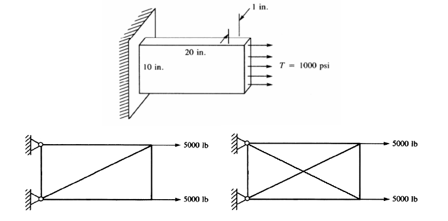
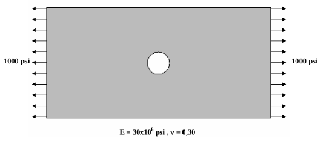

# Guía 4

1. Determine los desplazamientos de los bordes libres y los esfuerzos en
función de la posición para la placa empotrada mostrada en la figura.
Tome las dos particiones en elementos mostradas debajo y compare los
resultados. Asuma que $E = 30 \times 10^6~\psi y $\nu = 0.30$.

    

1. Determine la deformación y los esfuerzos principales en función de la
posición para una chapa con un agujero en el centro sujeta a tracción
por sus extremos, como se muestra en la figura. Las dimensiones de la
chapa son de $20 \times 10$ pulgadas y su espesor de una pulgada. El radio del
agujero central es también de 1 pulgada. Tome $E = 30 \times 10^6~\psi$ y $\nu = 0.30$.
Analice el problema con número creciente de elementos y estudie su
convergencia.

    

