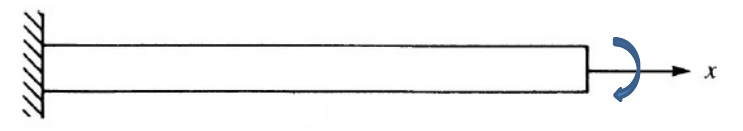

# Guía 5

1. Calcule las frecuencias naturales de oscilación **transversal** de una
barra de acero (densidad $7850~kg/m^3$ y módulo de elasticidad 
$E~=~210~GPa$), de $1~m$ de longitud, $10~cm^2$ de área y momento de inercia
$10~cm^4$. Realice el cálculo para un número variable de
elementos y estudie la convergencia de sus resultados. Haga el cálculo
para matrices de masa concentrada y consistente. Grafique los
desplazamientos verticales en función de la posición para los tres primeros modos
normales usando tanto directamente los resultados de las autofunciones 
como con las funciones de interpolación.

    

1. Se tiene un barra delgada de aluminio, originalemte a $0^\circ C$, cuyos extremos s someten repentinamente a temperaturas fijas. El extremo izquierdo se mantiene a una temperatura constante de $100^\circ C$ y el derecho a $50^\circ C$. Utilice el método de elementos finitos para calcular la evolución de la distribución de temperaturas en función del tiempo. Tome que la barra tiene 10 cm de longitud y las constantes del aluminio son: conductividad térmica, $k~=~203~W/m.^\circ C)$, calor específico, $c~=~900~J/(kg~^\circ C)$ y densidad $\rho≃2700~kg/m^3$. Haga los cálculos para $\Delta$x = 2 cm y $\Delta$t = 0.1 seg. 
Repítalos para $\Delta$t = 5 seg y compare sus resultados.
